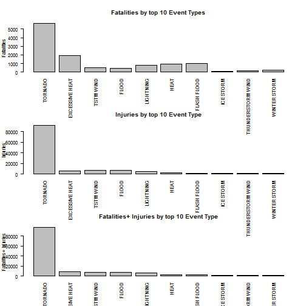
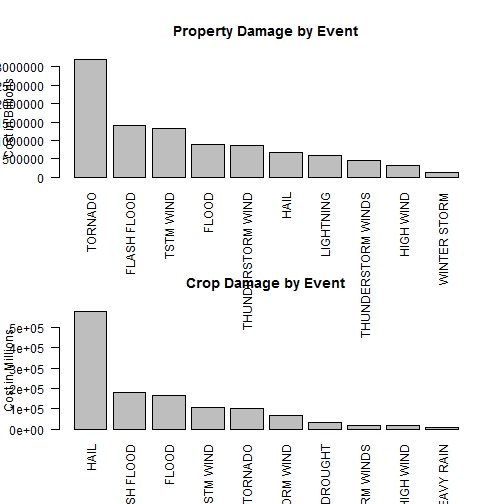

Date: " August 23, 2015"
---


# Synopsis:

It will asnwer two main questions: 1) Which types of events are most harmful with respect to population health and 2) which types of events have the greatest economic consequences.The data was collected from US National Oceanic and Atmosheric Administration's (NOAA) storm database.

output: 
  html_document:
    keep_md: true
---


## Processing Data

### 1. Load Data
**Data can be found and downloaded at [https://d396qusza40orc.cloudfront.net/repdata%2Fdata%2FStormData.csv.bz2]. Additional information on the data can be found at [http://www.ncdc.noaa.gov/stormevents/details.jsp?type=eventtype]

```r
Storm <- read.csv("Storm.csv")
```
### 2. Load neccessary R packages

```r
install.packages("dplyr")
```

```
## Error in install.packages : Updating loaded packages
```

```r
library(dplyr)
install.packages("plyr")
```

```
## Error in install.packages : Updating loaded packages
```

```r
library(plyr)
install.packages("tidyr")
```

```
## Error in install.packages : Updating loaded packages
```

```r
library(tidyr)
install.packages("ggplot2")
```

```
## Error in install.packages : Updating loaded packages
```

```r
library(ggplot2)
install.packages("gridExtra")
```

```
## Error in install.packages : Updating loaded packages
```

```r
library(gridExtra)
```

### 3. Create new dataset with only relevant columns
#### Since we're looking at Events, Fatalities, Injuries, Crop Damage, and Property Damage, all other columns are being removed. Even though other columns may be used for a more extensive anaylysis, for this case all others are bign removed.

```r
HUMPOP <- Storm[,c("EVTYPE", "FATALITIES", "INJURIES")]
ECON <- Storm[,c( "EVTYPE", "PROPDMG","CROPDMG")]
```
## RESULTS

### Create data frame sorted by Top 10 Event and Fatalities and Injuries

```r
HUMPOP$FATINJ <-HUMPOP$FATALITIES + Storm$INJURIES

HUMPOP2 <- ddply(HUMPOP, .(EVTYPE), summarize,
                    FATALITIES = sum(FATALITIES),
                    INJURIES = sum(INJURIES),
                    FATINJ = sum(FATINJ))

FAT10 <- head(HUMPOP2[order(HUMPOP2$FATALITIES, decreasing = TRUE), ], 10)
FAT10[,c(1:4)]
```

```
##             EVTYPE FATALITIES INJURIES FATINJ
## 834        TORNADO       5633    91346  96979
## 130 EXCESSIVE HEAT       1903     6525   8428
## 153    FLASH FLOOD        978     1777   2755
## 275           HEAT        937     2100   3037
## 464      LIGHTNING        816     5230   6046
## 856      TSTM WIND        504     6957   7461
## 170          FLOOD        470     6789   7259
## 585    RIP CURRENT        368      232    600
## 359      HIGH WIND        248     1137   1385
## 19       AVALANCHE        224      170    394
```

```r
INJ10 <- head(HUMPOP2[order(HUMPOP2$INJURIES, decreasing = TRUE), ], 10)
INJ10[,c(1:4)]
```

```
##                EVTYPE FATALITIES INJURIES FATINJ
## 834           TORNADO       5633    91346  96979
## 856         TSTM WIND        504     6957   7461
## 170             FLOOD        470     6789   7259
## 130    EXCESSIVE HEAT       1903     6525   8428
## 464         LIGHTNING        816     5230   6046
## 275              HEAT        937     2100   3037
## 427         ICE STORM         89     1975   2064
## 153       FLASH FLOOD        978     1777   2755
## 760 THUNDERSTORM WIND        133     1488   1621
## 244              HAIL         15     1361   1376
```

```r
FATINJ10 <- head(HUMPOP2[order(HUMPOP2$FATINJ, decreasing = TRUE), ], 10)
FATINJ10[,c(1:4)]
```

```
##                EVTYPE FATALITIES INJURIES FATINJ
## 834           TORNADO       5633    91346  96979
## 130    EXCESSIVE HEAT       1903     6525   8428
## 856         TSTM WIND        504     6957   7461
## 170             FLOOD        470     6789   7259
## 464         LIGHTNING        816     5230   6046
## 275              HEAT        937     2100   3037
## 153       FLASH FLOOD        978     1777   2755
## 427         ICE STORM         89     1975   2064
## 760 THUNDERSTORM WIND        133     1488   1621
## 972      WINTER STORM        206     1321   1527
```

### Create Bar Plot of Fatalities, Injuries by Event

```r
par(mfrow=c(3,1))

barplot(FATINJ10$FATALITIES, names.arg = FATINJ10$EVTYPE, main = "Fatalities by top 10 Event Types", 
        ylab = "Fatalities",las = 2)
barplot(FATINJ10$INJURIES, names.arg = FATINJ10$EVTYPE, main = "Injuries by top 10 Event Type", 
        ylab = "Injuries",las = 2)

barplot(FATINJ10$FATINJ, names.arg = FATINJ10$EVTYPE, main = "Fatalities+ Injuries by top 10 Event Type", 
        ylab = "Fatalities+ Injuries",las = 2)
```

 
### Create data frame sorted by Top 10 Property and Crop Damages

```r
ECON$PROPCROP <- ECON$PROPDMG + ECON$CROPDMG

ECON2 <- ddply(ECON, .(EVTYPE), summarize,
                    PropertyDamage = sum(PROPDMG),
                    CropDamage = sum(CROPDMG),
                    PropCropDMG = sum(PROPCROP))
                  
                                        
PROP10 <- head(ECON2[order(ECON2$PropertyDamage, decreasing = TRUE), ], 10)
PROP10[,c(1:4)]
```

```
##                 EVTYPE PropertyDamage CropDamage PropCropDMG
## 834            TORNADO      3212258.2  100018.52   3312276.7
## 153        FLASH FLOOD      1420124.6  179200.46   1599325.1
## 856          TSTM WIND      1335965.6  109202.60   1445168.2
## 170              FLOOD       899938.5  168037.88   1067976.4
## 760  THUNDERSTORM WIND       876844.2   66791.45    943635.6
## 244               HAIL       688693.4  579596.28   1268289.7
## 464          LIGHTNING       603351.8    3580.61    606932.4
## 786 THUNDERSTORM WINDS       446293.2   18684.93    464978.1
## 359          HIGH WIND       324731.6   17283.21    342014.8
## 972       WINTER STORM       132720.6    1978.99    134699.6
```

```r
CROP10 <- head(ECON2[order(ECON2$CropDamage, decreasing = TRUE), ], 10)
CROP10[,c(1:4)]
```

```
##                 EVTYPE PropertyDamage CropDamage PropCropDMG
## 244               HAIL      688693.38  579596.28  1268289.66
## 153        FLASH FLOOD     1420124.59  179200.46  1599325.05
## 170              FLOOD      899938.48  168037.88  1067976.36
## 856          TSTM WIND     1335965.61  109202.60  1445168.21
## 834            TORNADO     3212258.16  100018.52  3312276.68
## 760  THUNDERSTORM WIND      876844.17   66791.45   943635.62
## 95             DROUGHT        4099.05   33898.62    37997.67
## 786 THUNDERSTORM WINDS      446293.18   18684.93   464978.11
## 359          HIGH WIND      324731.56   17283.21   342014.77
## 290         HEAVY RAIN       50842.14   11122.80    61964.94
```

```r
PROPCROP10 <- head(ECON2[order(ECON2$PropCropDMG, decreasing = TRUE), ], 10)
PROPCROP10[,c(1:4)]
```

```
##                 EVTYPE PropertyDamage CropDamage PropCropDMG
## 834            TORNADO      3212258.2  100018.52   3312276.7
## 153        FLASH FLOOD      1420124.6  179200.46   1599325.1
## 856          TSTM WIND      1335965.6  109202.60   1445168.2
## 244               HAIL       688693.4  579596.28   1268289.7
## 170              FLOOD       899938.5  168037.88   1067976.4
## 760  THUNDERSTORM WIND       876844.2   66791.45    943635.6
## 464          LIGHTNING       603351.8    3580.61    606932.4
## 786 THUNDERSTORM WINDS       446293.2   18684.93    464978.1
## 359          HIGH WIND       324731.6   17283.21    342014.8
## 972       WINTER STORM       132720.6    1978.99    134699.6
```

### Create Bar Plot of Property and Crop Damages by Event

```r
par(mfrow=c(2,1))

Propplot <- barplot(PROP10$PropertyDamage, names.arg = PROP10$EVTYPE, main = "Property Damage by Event", 
        ylab = "Cost in Billions",las = 2)
Cropplot <- barplot(CROP10$CropDamage, names.arg = CROP10$EVTYPE, main = "Crop Damage by Event", 
        ylab = "Cost in Millions",las = 2)
```

 


